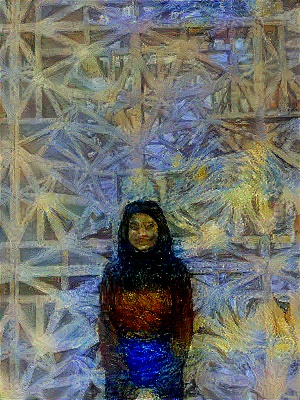

## Image Style Transfer Using CNNs

*Team members: Duncan Du, Isha Singh, Ziyao Shangguan*

This is the code repo for the Image Style Transfer Using CNNs project completed for the
Computer Vision course at Yale University. It contains Pytorch implementations of VGG16, VGG19,
and ResNet50 for neural style transfer. Theoretical foundations of this work are based on 
the NST paper (:link: [Gatys et al.](https://www.cv-foundation.org/openaccess/content_cvpr_2016/papers/Gatys_Image_Style_Transfer_CVPR_2016_paper.pdf)).

This repository is a fork of [Aleksa Gordić's repository](hub.com/gordicaleksa/pytorch-neural-style-transfer).
Gordić's repo contains implementations of VGG16, VGG19, and training code for 1-to-1 (1 content image and 
1 style image) style transfer.

We improved on Gordić's work significantly by implementing the following features:
* ResNet 50 for neural style transfer ([link to file](models/definitions/vgg_nets.py))
* Hyperparameter tuning for ResNet 50 and style transfer ([link to file](resnet_feature_map_tuning.py))
  * Both the content feature map index and the style weights were tuned
* 1-to-many style transfer ([link to file](neural_style_transfer_blend.py))
  * Learns a style from multiple style images instead of just one
* Video style transfer support ([link to file](neural_style_transfer_video.py))

## How to run?
### Setup
Requirements can be found in [environment.yml](environment.yml). Alternatively,
you can follow the below instructions:
1. Open Anaconda Prompt and navigate into project directory `cd path_to_repo`
2. Run `conda env create` (while in project directory)
3. Run `activate pytorch-nst`

### "1-Click" Run - Image Style Blends
**Note: this command takes about 1-2 hours to run with GPU.**

To generate blended style-transferred images from all images in the [data/content-images](data/content-images)
directory against all styles specified in the [data/style-images](data/style-images) directory, run the following command:

~~~shell
python generate_images.py
~~~

We have already ran this program and the results can be found in [data/output-images/blended](data/output-images/blended)

### "1-Click" Run - Video Style Blends
**Note: this command takes about 1-2 hours to run with GPU.**

To generate blended style-transferred videos from test.mov in the [data/content-videos](data/content-videos)
directory against miscellaneous_1.jpg, miscellaneous_3.jpg with 1:1 weights in the [data/style-images](data/style-images) directory, run the following command:

~~~shell
python neural_style_transfer_video.py
~~~

We have already ran this program and the result can be found in [data/transferred-videos](data/transferred-videos)

### Running blended style transfer on custom images
If you wish to run our style transfer on custom images, make sure that the content image is in the
[data/content-images](data/content-images) directory and all style images are in the
[data/style-images](data/style-images) directory. Then, you can run the following command, replacing
the image names with your custom images:

~~~shell
python neural_style_transfer_blend.py --content_img_name YOUR_CONTENT_IMAGE.jpg --style_img_name YOUR_STYLE_IMAGE1.jpg,YOUR_STYLE_IMAGE2.jpg
~~~
The default model is VGG19, but you can use the --model parameter to choose between ['vgg16', 'vgg19', and 'resnet'].

### Running blended style transfer on videos
You can also generate style-transferred videos! Put your video file (in .mov format) [data/content-videos](data/content-videos)
and run the following command, replacing video and image names with your custom files.

~~~shell
python neural_style_transfer_video.py --content_img_name YOUR_CONTENT_VIDEO.jpg --style_img_name YOUR_STYLE_IMAGE1.jpg,YOUR_STYLE_IMAGE2.jpg
~~~

The default model and model choices are identical to image style transfers.

**Note: video transfer takes about 30 minutes for every second of video, running with GPU.** 

You can find videos we already generated in [data/transferred-videos](data/transferred-videos).

## Examples

Picture of Ziyao in the style of Picasso's paintings. (Trained on ResNet50, VGG16, and VGG19 respectively)

Video Example

